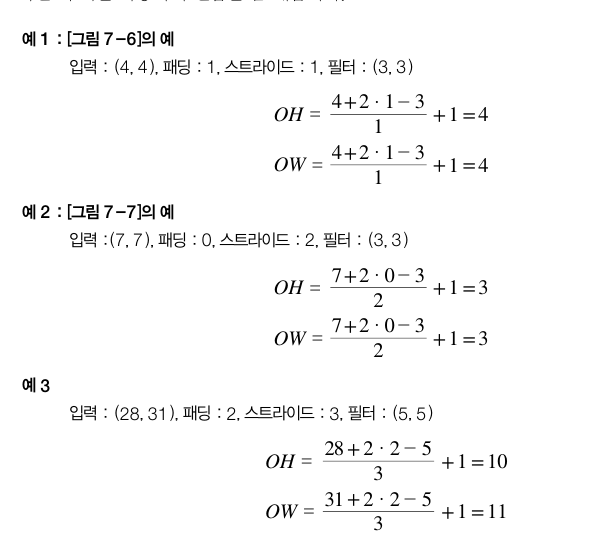

# 7. 합성곱 신경망 (CNN)

- 이번장의 주제는 합성곱 신경망 이다.

- CNN은 이미지 인식과 음성 인식 등 다양한 곳에서 사용되는데 이미지 인식 분야에서 딥러닝을 활용한 기법은 거의 다 CNN을 기초로 한다.

## 7.1 전체 구조

- CNN은 기존의 네트워크 구조에 합성곱 계층과 풀링 ㄱ계층이 등장한다.

- 지금까지의 신경망은 인접하는 계층의 모든 뉴런과 결합 되어 완전연결 이라고 한다.

- 완전히 연결된 계층을 Affine 계층 이라는 이름으로 구현

- Affine 계층은 그림 7-1과 같다.

 

 - Affine 계층 뒤에 활성화 함수를 갖는 ReLU 계층 혹은 sigmoid 계층이 이어진다

 - 이 그림에서는 Affine - ReLU 조합이 4개가 있고 마지막 5층은 Affine 계층에 이어 소프트 맥스 계층에서 최종 결과를 출력한다.

 - CNN의 구조는 그림 7-2와 같다.

  

  - 위와 같이 CNN 에서는 새로운 합성곱 계층 CONV 과 풀링 계층 POOLING 이 추가된다.

  - CNN의 계층은 CONV-ReLU-POOLING으로 연결된다.

  - CNN에서는 출력에 가까운 층에서는 지금까지의 Affine - ReLU 구성을 사용할수 있다는 점이다.

  - 마지막 출력 계층에서는 Affine-Softmax 조합을 그대로 사용한다.

 ## 7.2 합성곱 계층

 - CNN에서는 패딩, 스트라이드 등의 CNN의 고유의 용어가 등장한다.

 - 각 계층 사이에는 3차원 데이터 값이 입체적인 데이터가 흐른다는 점에서 완전 연결 신경망과 다르다.

 - 이번 절에서는 CNN에서 사용하는 함성곱 계층의 구조를 살펴본다

 ### 7.2.1 완전연결 계층의 문제점

 - 지금까지 본 완전연결 신경망에서는 완전 연결 계층을 사용했다.

 - 완전연결 계층의 문제점은 데이터의 형상이 무시 된다는 사실이다.

 - 입력데이터인 이미지의 예를 보면 2차원 좌표에 3개의 색 값이 들어간 3차원 데이터 이다.
 - 완전 연결은 데이터의 형상을 무시하고 모든 입력 데이터를 동등한 뉴런으로 취급하여 형상을 살릴수가 없다.

 - 반면 합성곱 계층은 형상을 유지해 다음 계층에도 3차원 데이터로 데이터를 전송한다

 - 따라서 CNN에서는 이미지처럼 형상을 가진 데이터를 제대로 이해할 가능성이 존재한다.

 - CNN에서는 합성곱 계층의 입출력 데이터를 특징 맵 이라고 한다

 - 합성곱 계층의 입력 데이터를 입력 특징 맵, 출력 데이터를 출력 특징 맵 이라고 한다.

 - 이 책에서는 입출력 데이터와 특징 맵을 같은 의미로 사용한다.

 ### 7.2.2 합성곱 연산

 - 합성곱 계층에서의 합성곱 연산을 처리한다

 - 이미지 처리에서 말하는 필터 연산이다.

  

  - 그림 7-3의 합성곱 연산 예에서 어떤 계산이 이뤄지는지 보여준다

  - 합성곱 연산은 필터의 윈도우를 일정 간격으로 이동해가며 입력 데이터에 적용한다.

  

  - 완전 연결 신경망에는 가중치 매개변수와 편향이 존재하는데 CNN에서의 필터의 매개변수가 그동안의 가중치에 해당한다 

   

   - 그림 7-5 와 같이 편향은 필터를 적용한 후의 데이터에 더해진다. 그리고 편향은 하나 1x1 만 ㅈ본재한다.

   ### 7.2.3 패딩

   - 합성곱 연산을 수행하기 전에 입력 데이터 주변을 특정값 으로 채우기도 한다 이를 패딩이라고 한다.

   - 그림 7-6은 4,4 크기의 입력 데이터에 폭이 1인 패딩을 적용한 모습이다.

    

   ### 7.2.4 스트라이드

   - 필터를 적용하는 위치의 간격을 스트라이드 라고 한다.

   - 지금까지 본 예는 모두 스트라이드가 1이지만 2로하면 필터를 적용하는 윈도우가 두칸씩 이동한다

    

   - 스트라이드를 하면 출력 크기가 작아진다.

   - 이걸 식으로 나타내면 다음과 같이 나타낼수 있다.

- 입력 크기를 H,W 필터 크기를 FH,FW 출력 크기를 OH,OW 패딩을 P 스트라이드를 S 라하면 출력크기가 위 식처럼 나온다.

- 위의 예처럼 식 7-1에 값을 대입하면 출력 크기를 구할수 있다.

