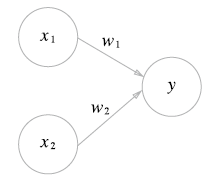
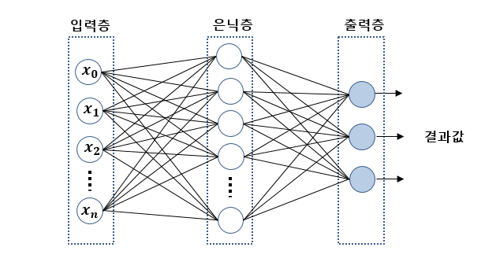

# 2.perceptron (6/5)


    -퍼셉트론은 신경망(딥러닝) 의 기원이 되는 알고리즘이다!

##   2.1 퍼셉트론이란?

    - 퍼셉트론은 "  다수의 신호"를 입력으로 받아 하나의 신호를 출력한다!
    - 신호가 흐른다 1 안흐른다 0 의 값을 가질수 있다!



- x<sub>1</sub>, x<sub>2</sub>은 입력신호 w<sub>1</sub>, w<sub>2</sub>은 가중치 y는 출력 신호를 뜻한다
- 위의 그림은 2개의 입력신호를 받는 퍼셉트론의 예시이다!
- 그림의 원을 뉴런 혹은 노드 라고 부른다
- 입력 신호가 뉴런에 보내질 때 고유한 가중치가 곱해진다.
- 뉴런에서는 받은 신호의 총합이 정해진 한계를 넘을때만 1을 출력
- 여기서의 한계를 임계값 Θ(theta)라고 표현

이 내용을  식으로 표현하면 다음과 같이 표현이 가능하다.

--식 2.1--
$$y= \begin{cases}0   ,(   w_{1}x_{1} +w_{2}x_{2} \leq \theta    ) \\1  ,(    w_{1}x_{1} +w_{2}x_{2}  >  \theta    ) \end{cases}  $$

***
## 2.2 단순한 논리회로
***
### 2.2.1 AND 게이트

    -AND 게이트는 입력이 2개이고 출력이 하나이다.
    -두 입력이 모두 참이면 출력도 참
    -그 외의 경우는 모두 거짓이다.


-   AND 게이트를 퍼셉트론으로 표현을 하면 진리표 대로 작동하는 w<sub>1</sub>, w<sub>2</sub>, Θ를 정하면 된다!
-   조합의 수는 무수히 많지만 예를 들어 (w<sub>1</sub>, w<sub>2</sub>, Θ)= (1.1 , 1.1, 2) 같이 할수가 있다!

### 2.2.2 NAND 게이트와 OR 게이트

    - NAND 게이트는 not AND 게이트를 의미하며 그 동작은 AND 게이트의 정 반대이다.
    - 이것을 퍼셉트론으로 표현하는 순서쌍중 하나는 (w<sub>1</sub>, w<sub>2</sub>, Θ)= (-0.5, -0.5, -0.7)


    -OR 게이트는 입력 신호눈 하나 이상이 1이면 출력이 1이되는 논리회로 이다!


    - 여기서 중요한 점은 3가지의 gate 모두 퍼셉트론의 구조가 똑같다는 것이다!
***
## 2.3 퍼셉트론 구현하기

***
### 2.3.1 간단한 구현부터
    - 논리 회로를 파이썬으로 구현

```python
    def AND(x1,x2):
        w1, w2, theta= 0.5, 0.5, 0.7
        tmp = x1*w1 + w2*x2
        if tmp <=theta:
            return 0
        elif    tmp > theta :
            return 1
```
    - 결과값은 AND 의 진리표와 같이 나온다.

### 2.3.2 가중치와 편향 도입

    - 식 2.1의 Θ를 -b로 치환하면 다음과 같은 식이 나온다.
--식 2.1--
$$y= \begin{cases}0   ,( b+  w_{1}x_{1} +w_{2}x_{2} \leq 0    ) \\1  ,(b+    w_{1}x_{1} +w_{2}x_{2}  >  0   ) \end{cases}  $$

    - 식 2.2.와 2.1 은 표기만 다를뿐 같은 식이다!
    - 여기에서 b를 편향(bias) 이라 한다!
    - 식 2.2 의 관점에서는 퍼셉트론은 입력 신호에 가중치를 곱한 값과 편향을 합하여, 그 값이 0을 넘으면 1을 출력하고 그렇지 않으면 0을 출력한다
    
    - 넘파이를 사용하면 다음과 같이 표현이 가능하다.

```python
import numpy as np
x = np.array([0,1])             #입력
w = np.array([0.5, 0.5])        #가중치
b = -0.7                        #편향

x*w                             #[0. , 0.5]
np.sum(w*x)                     #0.5
np.sum(w*x)+b                   #0.199999999999999 대략 0.2
```

    - x의 원소가 1개 이므로 브로드캐스팅 해서 곱샘이 가능
### 2.3.3 가중치와 편향 구현하기

    - 가중치와 편향을 도입한 AND 게이트는 다음과 같이 구현이 가능하다.

```python
    def AND(x1, x2):
        x = np.array([x1,x2])
        w = np.array([0.5 , 0.5])
        b = -0.7

        tmp = np.sum(x*y) + b
        if  tmp <= 0:
            return 0
        else:
            return 1


```
- w<sub>1</sub>, w<sub>2</sub> 는 각 입력 신호가 결과에 주는 영향력을 조절하는 매개변수
- b(편향)은 뉴런이 얼마나 쉽게 활성화(결과를 1로 출력) 하느냐를 조절하는 매개변수


***
    - NAND 게이트, OR 게이트

```python
    def NAND(x1, x2):
        x=np.array([x1, x2])
        w=np.array([-0.5,-0.5])
        b=0.7

        temp = np.sum(w*x) + b
        if tmp <= 0 :
            return 0
        else:
            return 1

    def OR(x1, x2):
        x=np.array([x1, x2])
        w=np.array([0.5, 0.5])
        b=-0.2

        temp = np.sum(w*x) + b
        if tmp <= 0 :
            return 0
        else:
            return 1
```

***
##  2.4 퍼셉트론의 한계

    - AND, OR, NAND 게이트를 퍼셉트론으로 구현할수 있지만 XOR은 불가능하다.

### 2.4.1 도전! XOR 게이트

    -xor 게이트는 배타적 논리합 이라는 논리회로이다.
-   x<sub>1</sub>, x<sub>2</sub> 중 한쪽이 1일 때만 1을 출력한다.


- 왜 지금까지 본 퍼셉트론으로는 xor 게이트를 표현할수 없을까?


- 위 그래프의 식을 다음과 같이 나타낼수 있다

--식 2.3--
$$y= \begin{cases}0   ,( -0.5 +  x_{1} +x_{2} \leq 0    ) \\
1  (-0.5 +  x_{1} +x_{2}  >  0   ) \end{cases}  $$

-   or 게이트는 (0,0) 일때 0을 출력하고 (1,0),(0,1),(1,1)일 때는 1을 출력해야한다.
-   따라서 위의 그래프는 직선을 그어서 각 점(좌표)를 나누고 있다.
-   이때 xor 은(1,1)일때 0을 나타내야 하는데 이것을 직선 하나로 표현하기에는 불가능 하다.

### 2.4.2 선형과 비선형

- 따라서 다음과 같이 곡선을 이용하면 나눌수 있다.


-  위 그래프와 같이 곡선의 영역을 비선형 영역, 직선의 영역을 선형 영역이라고 한다.

***

## 2.5 다층 퍼셉트론이 출동한다면

- 하나의 퍼셉트론으로는 xor 게이트를 표현할 수 없다.
- 하지만 여러개의 퍼셉트론을 이용하면 표현이 가능하다. 이를 다층 퍼셉트론 이라고 한다.

### 2.5.1 기존 게이트 조합하기

- xor 게이트를 만드는 방법은 and, nand, or 게이트를 조합하면 가능하다.
- 다음 그림은 and, nand, or 게이트를 그림으로 표현한 것이다.


- 이것을 다음과 같이 조합하면 xor을 표현 할수 있다


### 2.5.2 XOR 게이트 구현하기
- 위의 XOR 게이트를 파이썬으로 구현해보자

```python
    def XOR(x1, x2):
        s1 = NAND(x1, x2)
        s2 = OR(x1, x2)
        y = AND(s1, s2)
        return y
```
- 이것을 뉴런을 이용한 퍼셉트론으로 표현하면 다음과 같다.

- 이처럼 층계가 여러개인 퍼셉트론을 다층 퍼셉트론 이라고 한다.

- 위 그림과 같이 더 많은 층을 만들어서 표현도 가능하다.
